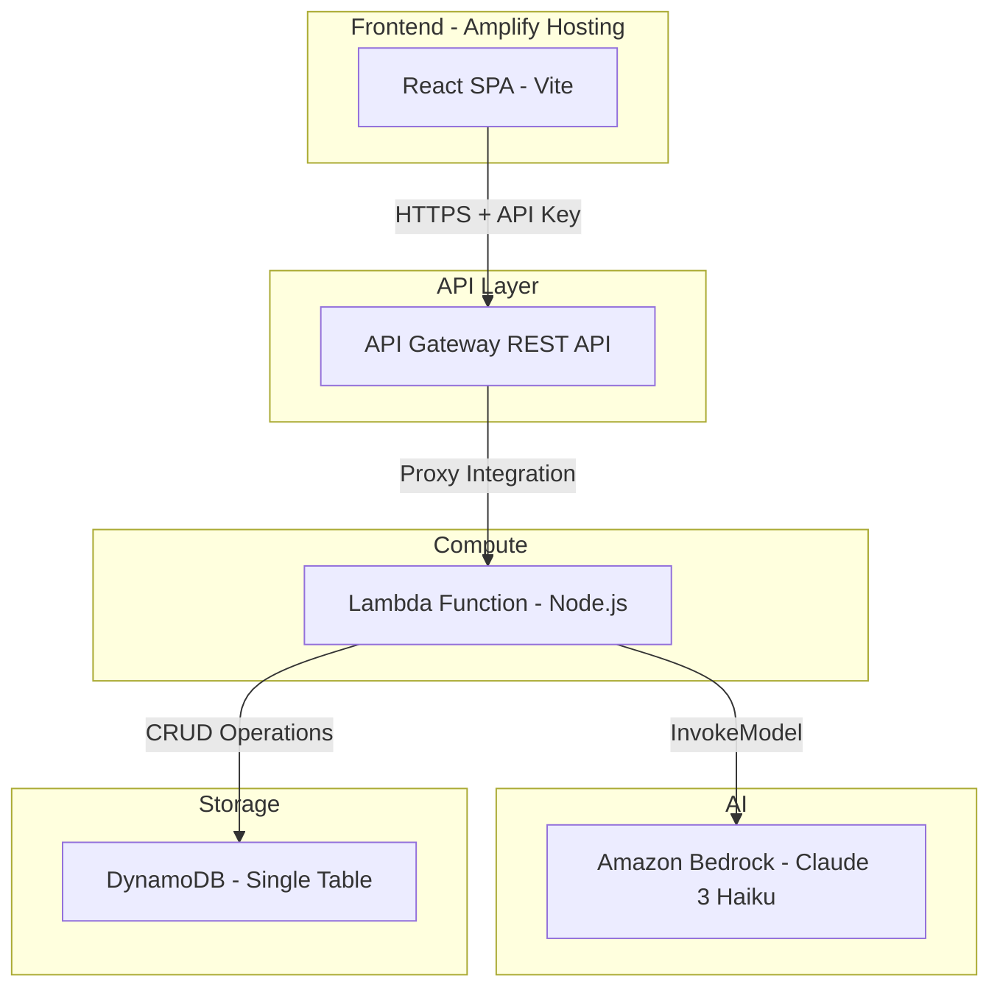

# Design Document

## Overview

AI Smart To-Do with Priority Scoring is a serverless web application that combines a React SPA frontend with an AWS-powered backend to deliver intelligent task management. The system accepts plain-text task descriptions, routes them through Amazon Bedrock for AI categorization (Eisenhower Matrix) and priority scoring (1-100), and presents users with a zero-friction interface including daily "Top 3" task recommendations.

The architecture prioritizes weekend deployability, AWS Free Tier compatibility, and minimal operational complexity. User identification relies on a UUID stored in browser localStorage — no authentication flow required.

### Key Design Decisions

1. **Single Lambda function with route handling** — reduces cold starts and deployment surface vs. multiple Lambdas
2. **DynamoDB single-table design** — one table serves all access patterns (tasks by user, tasks by score, completed tasks)
3. **Synchronous AI invocation** — Bedrock call happens inline during task creation for immediate feedback; async retry for failures
4. **React + Vite SPA on Amplify Hosting** — fastest path to production-grade CDN hosting with HTTPS
5. **API key auth via API Gateway** — simple, no-Cognito approach matching the "no authentication complexity" constraint

## Architecture



### Request Flow

1. User interacts with React SPA (served from Amplify CDN)
2. Frontend sends request to API Gateway with API key header and user UUID
3. API Gateway validates API key, proxies to Lambda
4. Lambda processes request:
   - For task creation: validates input → writes to DynamoDB → calls Bedrock → updates task with AI results
   - For reads: queries DynamoDB by user ID
   - For updates/deletes: modifies DynamoDB records, triggers score recalculation
5. Response returned to frontend with AI-enriched task data

### Async AI Processing Pattern

For task creation, the design uses a "write-then-enrich" pattern:
1. Task is immediately saved to DynamoDB with default values (quadrant: "Schedule", score: 50)
2. Bedrock is invoked for categorization and scoring
3. If successful, task is updated with AI results
4. If Bedrock fails, task retains defaults and is flagged for retry
5. A separate "recalculate" endpoint handles batch re-scoring when tasks change

## Components and Interfaces

### Frontend Components

| Component | Responsibility |
|-----------|---------------|
| `App` | Root layout, routing, global state |
| `TaskInput` | Text input with validation (1-500 chars, trimmed) |
| `TopThreePanel` | Displays daily AI recommendations |
| `QuadrantView` | Four-panel Eisenhower Matrix display |
| `TaskCard` | Individual task with score, quadrant label, actions |
| `CompletedSection` | Collapsed section showing completed tasks |
| `EmptyState` | Prompts when no tasks exist |
| `ErrorBanner` | Displays API errors with retry option |

### Backend API Endpoints

| Method | Path | Description |
|--------|------|-------------|
| `POST` | `/tasks` | Create a new task |
| `GET` | `/tasks` | Get all tasks for user |
| `PATCH` | `/tasks/{taskId}/complete` | Mark task as complete |
| `PATCH` | `/tasks/{taskId}/incomplete` | Restore task to incomplete |
| `DELETE` | `/tasks/{taskId}` | Delete a task |
| `POST` | `/tasks/top-three` | Generate/refresh top-three recommendations |
| `POST` | `/tasks/recalculate` | Trigger priority recalculation for all tasks |

### API Request/Response Contracts

**POST /tasks**
```json
// Request
{
  "description": "string (1-500 chars after trim)"
}

// Response 200
{
  "taskId": "uuid",
  "description": "string",
  "quadrant": "do-first | schedule | delegate | eliminate",
  "priorityScore": 1-100,
  "status": "incomplete",
  "createdAt": "ISO 8601 timestamp"
}
```

**GET /tasks**
```json
// Response 200
{
  "tasks": [
    {
      "taskId": "uuid",
      "description": "string",
      "quadrant": "do-first | schedule | delegate | eliminate",
      "priorityScore": 1-100,
      "status": "incomplete | complete",
      "createdAt": "ISO 8601 timestamp",
      "completedAt": "ISO 8601 timestamp | null"
    }
  ],
  "topThree": ["taskId1", "taskId2", "taskId3"]
}
```

**Error Response**
```json
{
  "error": {
    "code": "VALIDATION_ERROR | NOT_FOUND | AI_UNAVAILABLE | INTERNAL_ERROR",
    "message": "Human-readable error description",
    "retryAfter": 30  // seconds, only for AI_UNAVAILABLE
  }
}
```

### Internal Modules

| Module | Responsibility |
|--------|---------------|
| `handler.ts` | Lambda entry point, request routing |
| `validator.ts` | Input validation (description length, UUID format) |
| `taskService.ts` | Business logic orchestration |
| `aiService.ts` | Bedrock integration, prompt construction, response parsing |
| `dbService.ts` | DynamoDB operations |
| `scorer.ts` | Priority score calculation and recalculation logic |

### AI Prompt Design

The Bedrock prompt instructs the model to return structured JSON:

```
Analyze the following task and return a JSON response:
- "quadrant": one of "do-first", "schedule", "delegate", "eliminate"
- "priorityScore": integer 1-100
- "reasoning": brief explanation

Rules for quadrant assignment:
- "do-first": urgent AND important (deadlines today/tomorrow, critical keywords)
- "schedule": important but NOT urgent (goals, projects, growth)
- "delegate": urgent but NOT important (routine, low-impact deadlines)
- "eliminate": neither urgent nor important (distractions, low-value)

Rules for scoring:
- Base score from quadrant: do-first=75-100, schedule=50-74, delegate=25-49, eliminate=1-24
- Adjust up for: explicit deadlines, action verbs, specificity
- Adjust down for: vague language, no timeline, passive phrasing

Task: "{description}"
Context: User has {taskCount} other tasks. Current date: {today}.
```

## Data Models

### DynamoDB Single-Table Design

**Table Name:** `ai-smart-todo`

| Attribute | Type | Description |
|-----------|------|-------------|
| `PK` | String | Partition key: `USER#{userId}` |
| `SK` | String | Sort key: `TASK#{taskId}` |
| `userId` | String | UUID v4 user identifier |
| `taskId` | String | UUID v4 task identifier |
| `description` | String | Task text (1-500 chars) |
| `quadrant` | String | Eisenhower quadrant enum |
| `priorityScore` | Number | 1-100 integer |
| `status` | String | `incomplete` or `complete` |
| `createdAt` | String | ISO 8601 timestamp |
| `completedAt` | String | ISO 8601 timestamp (nullable) |
| `aiProcessed` | Boolean | Whether AI has categorized this task |
| `GSI1PK` | String | `USER#{userId}#STATUS#incomplete` |
| `GSI1SK` | String | `SCORE#{priorityScore (zero-padded)}` |

### Access Patterns

| Access Pattern | Key Condition |
|----------------|--------------|
| Get all tasks for user | `PK = USER#{userId}` |
| Get incomplete tasks sorted by score | GSI1: `GSI1PK = USER#{userId}#STATUS#incomplete`, sort by `GSI1SK` DESC |
| Get single task | `PK = USER#{userId}`, `SK = TASK#{taskId}` |

### Global Secondary Index

**GSI1** — enables querying incomplete tasks sorted by priority score:
- Partition Key: `GSI1PK`
- Sort Key: `GSI1SK`
- Projection: ALL

### Frontend State Model

```typescript
interface Task {
  taskId: string;
  description: string;
  quadrant: 'do-first' | 'schedule' | 'delegate' | 'eliminate';
  priorityScore: number;
  status: 'incomplete' | 'complete';
  createdAt: string;
  completedAt: string | null;
}

interface AppState {
  tasks: Task[];
  topThree: string[];  // taskId references
  isLoading: boolean;
  error: string | null;
  userId: string;
}
```

### Validation Rules

| Field | Rule |
|-------|------|
| `description` | Trim whitespace, then 1-500 chars. Reject empty/whitespace-only. |
| `userId` | Valid UUID v4 format (`/^[0-9a-f]{8}-[0-9a-f]{4}-4[0-9a-f]{3}-[89ab][0-9a-f]{3}-[0-9a-f]{12}$/i`) |
| `taskId` | Valid UUID v4 format |
| `quadrant` | One of: `do-first`, `schedule`, `delegate`, `eliminate` |
| `priorityScore` | Integer, 1 ≤ score ≤ 100 |
| `status` | One of: `incomplete`, `complete` |


## Correctness Properties

*A property is a characteristic or behavior that should hold true across all valid executions of a system — essentially, a formal statement about what the system should do. Properties serve as the bridge between human-readable specifications and machine-verifiable correctness guarantees.*

### Property 1: Task description validation

*For any* string input, the validation function SHALL accept the input if and only if the trimmed string has length between 1 and 500 characters (inclusive), and SHALL reject empty strings, whitespace-only strings, and strings exceeding 500 characters after trimming.

**Validates: Requirements 1.2, 1.3**

### Property 2: AI response parsing produces valid domain values

*For any* raw response string from the AI engine (including malformed, partial, or unexpected output), the response parser SHALL produce exactly one valid quadrant from {do-first, schedule, delegate, eliminate} and exactly one integer priority score in the range [1, 100], falling back to defaults (quadrant: "schedule", score: 50) when parsing fails.

**Validates: Requirements 2.1, 3.1, 3.5**

### Property 3: Top-three selection correctness

*For any* list of incomplete tasks with priority scores, the top-three selection SHALL return the tasks with the highest priority scores in descending order, returning all tasks when fewer than three exist, and returning an empty list when no incomplete tasks exist.

**Validates: Requirements 4.2, 4.4**

### Property 4: View filtering invariant

*For any* set of tasks, the active (incomplete) view SHALL contain only tasks with status "incomplete" that have not been deleted, and SHALL never include completed or deleted tasks.

**Validates: Requirements 5.3, 6.3**

### Property 5: Task completion round-trip

*For any* incomplete task with a known quadrant, marking it as complete and then marking it as incomplete SHALL restore the task to the active view with its original Eisenhower Matrix quadrant preserved.

**Validates: Requirements 5.5**

### Property 6: Task ordering within quadrant view

*For any* set of incomplete tasks, the display ordering SHALL group tasks by quadrant in the order [do-first, schedule, delegate, eliminate], and within each quadrant SHALL sort tasks by priority score descending, with ties broken by creation timestamp descending (most recent first).

**Validates: Requirements 7.1, 7.2**

### Property 7: Task data persistence round-trip

*For any* valid task object, storing it to the Task_Store and then retrieving it SHALL return an object with identical values for description, quadrant, priorityScore, status, and createdAt fields.

**Validates: Requirements 9.1**

### Property 8: UUID v4 validation and generation

*For any* string stored as a user identifier, the validation function SHALL accept it if and only if it matches the UUID v4 format specification, and SHALL trigger generation of a new valid UUID v4 when the stored value is invalid or absent.

**Validates: Requirements 10.1, 10.4**

### Property 9: API key authorization gate

*For any* incoming API request, the authorization middleware SHALL allow processing if and only if the request contains a valid API key header matching the authorized value, and SHALL reject with 401 status otherwise.

**Validates: Requirements 8.3, 8.4**

### Property 10: Request body validation

*For any* request body submitted to task creation, the validator SHALL return a 400 error with field-specific error messages when required fields are missing or have invalid types, and SHALL pass validation when all fields meet their constraints.

**Validates: Requirements 8.6, 1.3**

## Error Handling

### Error Categories

| Category | HTTP Status | Client Behavior |
|----------|-------------|-----------------|
| Validation Error | 400 | Display field-level error, preserve input |
| Unauthorized | 401 | Regenerate user ID, retry once |
| Not Found | 404 | Remove task from local state |
| AI Unavailable | 503 | Show task with defaults, retry in background |
| Internal Error | 500 | Display generic error, offer retry |

### Retry Strategy

| Operation | Max Retries | Interval | Fallback |
|-----------|-------------|----------|----------|
| AI categorization | 3 | 5 seconds | Quadrant: "schedule" |
| AI scoring | 3 | 5 seconds | Score: 50 |
| DynamoDB write | 1 | 2 seconds | Return error, preserve client state |
| DynamoDB read | 1 | 2 seconds | Return error, show cached state |
| Top-three generation | 0 | N/A | Local sort by score, take top 3 |

### Frontend Error UX

- **Optimistic updates**: UI updates immediately on user action, rolls back on API failure
- **Error banners**: Non-blocking banners for recoverable errors (auto-dismiss after retry success)
- **Input preservation**: On creation failure, user's text stays in the input field
- **Graceful degradation**: Tasks without AI results show defaults (quadrant label, score 50)

### Circuit Breaker Pattern (AI Service)

After 3 consecutive AI failures:
1. Stop calling Bedrock for 60 seconds
2. Assign all new tasks default values
3. Queue tasks for batch re-processing
4. Resume Bedrock calls after cooldown

## Testing Strategy

### Property-Based Testing

**Library**: [fast-check](https://github.com/dubzzz/fast-check) (TypeScript/JavaScript PBT library)

**Configuration**: Minimum 100 iterations per property test.

**Tag Format**: `Feature: ai-smart-todo, Property {number}: {property_text}`

Property-based tests will target the pure logic layers:

| Property | Module Under Test | Generator Strategy |
|----------|------------------|--------------------|
| P1: Description validation | `validator.ts` | Random strings (0-1000 chars), whitespace variants, unicode |
| P2: AI response parsing | `aiService.ts` | Random JSON-like strings, partial responses, malformed output |
| P3: Top-three selection | `scorer.ts` | Random task arrays (0-50 items) with random scores 1-100 |
| P4: View filtering | State management | Random task arrays with mixed statuses + deletion flags |
| P5: Completion round-trip | `taskService.ts` | Random tasks with known quadrants |
| P6: Task ordering | Display logic | Random tasks in same/different quadrants with random scores and timestamps |
| P7: Data round-trip | `dbService.ts` | Random valid task objects (all field combinations) |
| P8: UUID validation | User ID module | Random strings (valid UUID v4, invalid formats, empty) |
| P9: API key auth | `handler.ts` middleware | Random header objects (with/without key, valid/invalid values) |
| P10: Request body validation | `validator.ts` | Random objects (missing fields, wrong types, boundary values) |

### Unit Tests (Example-Based)

- Task creation success flow (verify all fields populated)
- Empty state rendering (no tasks → invitation prompt)
- Completed task styling (strikethrough applied)
- Error banner display on API failure
- Input field cleared after success, preserved after failure
- Confirmation dialog appears before deletion
- All four quadrants rendered even when empty
- Top-three panel positioned above quadrant view
- API key 503 response includes retry-after header

### Integration Tests

- End-to-end task creation with Bedrock invocation (mocked)
- DynamoDB read/write operations
- API Gateway CORS preflight handling
- Recalculation endpoint updates all task scores
- Full lifecycle: create → complete → restore → delete

### Test Environment

- **Unit/Property tests**: Vitest with fast-check, no AWS dependencies
- **Integration tests**: LocalStack for DynamoDB, mocked Bedrock responses
- **E2E tests**: Playwright against deployed staging environment (optional, post-weekend)

